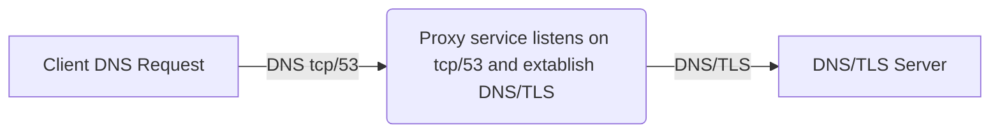

# DNS-over-TLS(DoT) Proxy Service

DNS-over-TLS (DoT) is a protocol that enhances the security and privacy of DNS (Domain Name System) queries by encrypting the communication between DNS clients and servers

## why DoT?

DNS queries primarily use UDP, a connectionless protocol, which makes them inherently less secure than protocols like TCP, but not necessarily "more viable" for attacks compared to well-crafted attacks on other protocols. 

However, the lack of encryption in DNS traffic can make it more susceptible to eavesdropping and tampering, regardless of the protocol used

## About this project,

This project implements a simple DNS proxy server that supports both TCP and UDP connections.
It forwards DNS queries to the specified DoT (DNS over TLS) server or a regular UDP server, depending on the client's request.



Similarly, UDP request also will be handled.

## Installation:

**Pre-Requisites:**

- Variables Check: (Modify Accordingly)
    - PROXY_SERVER = "127.0.0.1" (Configured to run from localhost, Use particular IP or 0.0.0.0 for accepting connections from all netwrok devides)
    - PROXY_PORT = 53 (For testing, Change the port to any greater than 1024. Port 53 requires sudo access)


- Python libraries
  - Standard libraries like `ssl`, `socket`, `select`, and `threading` are imported and come by default with Python.


**Run using python:**

```
python dot_tls_proxy.py 
```

Exit the service by kill command or ctrl+c

**Run using Docker:**


Build the image:
````
docker build -t dot_proxy . 
````

Run the docker in detach mode by listening to both tcp and udp
````
docker run -d -p 5053:5053/udp -p 5053:5053/tcp --name dot_proxy dot_proxy 
````

Stop the proxy service

````
docker ps
(Identify the dot_proxy container id )

docker stop <container id>

````

## Usage:

For testing TCP connection:

````
dig +tcp n26.com @localhost
````


For testing udp connection:

````
dig n26.com @localhost
````


- Modify the localhost with particular IP, if you customize the `PROXY_SERVER`
- Add -p <port number> at the end of dig command like,`dig +tcp n26.com @localhost -p <port number>`, if you customize `PROXY_PORT`

## Security Concerns


- **Authentication**: Implementing client authentication ensures that only authorized clients can use the proxy. This helps prevent misuse and unauthorized access.


- **Logging**: Carefully manage and secure log files to avoid exposing sensitive information. Implement logging controls to track and monitor DNS queries and responses for security analysis.


- Code doesn't explicitly validate the data received from clients. This could potentially lead to vulnerabilities like buffer overflows or code injection attacks

## Integration with Microservices and Containers:

To integrate this solution in a modern architecture:

- Containerization:
  - As mentioned in installation steps, Build the Docker image and push to docker/third party repository to ensure portability and easy deployment across various environments.
  - Before going to be deployed production, need to fix the security concerns 


- Orchestration: 
  - Use container orchestration tools like Kubernetes to manage and scale the proxy instances dynamically. 
  - This enables seamless integration into a microservices-oriented architecture.

## Other Improvements:

- Parameterization
- Code catches specific exceptions like socket.timeout and ssl.SSLError but doesn't handle other potential errors that might occur during communication with the DoT server.
- Consider using secure communication protocols like TLS to encrypt the communication between the proxy server and the client as well.
- Implementing TLS V1.3, But not all the servers now supporting this
- Using With Statement to handle socket creation and cleanup
- Having host check and proper certs while handling the connection from custom platform
- Making use of DTLS package to make UDP request also more secured
- Logging needs to be improved
- Threading concept is used now, but asyncio can be used to improve the performance 
- creating python package for proxy service  
